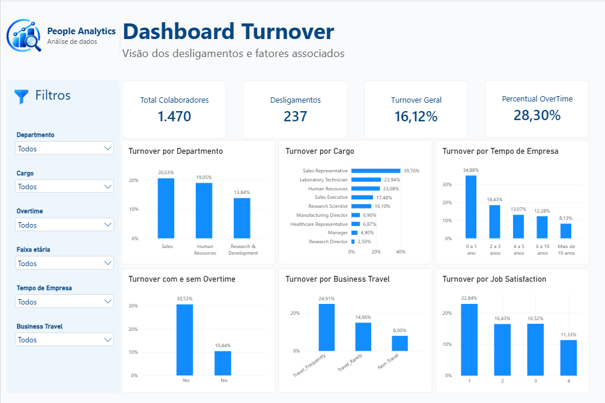

# Dashboard de Turnover | People Analytics

Dashboard desenvolvido em **Power BI** para transformar a análise de turnover em uma visão executiva, interativa e de fácil interpretação.

O objetivo é permitir que áreas de People e lideranças identifiquem rapidamente onde estão as maiores taxas de desligamento e quais grupos merecem maior atenção.

## Visão geral

O dashboard apresenta os principais indicadores da base analisada:

- **1.470 colaboradores**
- **237 desligamentos**
- **16,12% de turnover geral**
- **28,30% dos colaboradores com OverTime**

## Funcionalidades

### Indicadores principais

Os cards no topo permitem acompanhar rapidamente:

- **Total de colaboradores:** quantidade total de profissionais presentes na base.
- **Desligamentos:** número de colaboradores que deixaram a empresa.
- **Turnover geral:** percentual de desligamentos em relação ao total de colaboradores.
- **OverTime:** percentual de profissionais que realizam horas extras.

### Turnover por Departamento

Permite comparar a taxa de turnover entre as diferentes áreas da empresa e identificar quais departamentos apresentam maior proporção de desligamentos.

### Turnover por Cargo

Apresenta os cargos ordenados pela taxa de turnover, facilitando a identificação das funções com maior exposição ao desligamento.

### Turnover por Tempo de Empresa

Analisa o comportamento do turnover de acordo com o tempo de permanência na organização.

A visualização permite identificar rapidamente a maior concentração de turnover entre profissionais com menor tempo de empresa.

### Turnover e Horas Extras

Compara colaboradores que realizam horas extras com aqueles que não realizam.

Esse indicador ganhou destaque na análise porque o grupo com **OverTime apresentou uma taxa de turnover significativamente maior**.

### Turnover por Business Travel

Permite comparar a taxa de turnover de acordo com a frequência de viagens a trabalho.

A análise ajuda a identificar diferenças entre profissionais que não viajam, viajam raramente ou viajam com frequência.

### Turnover por Job Satisfaction

Apresenta a taxa de turnover de acordo com os níveis de satisfação no trabalho.

Essa visualização permite observar como diferentes níveis de satisfação se relacionam com os desligamentos.

### Filtros interativos

O dashboard permite segmentar a análise por diferentes características dos colaboradores, possibilitando aprofundar a investigação por grupos específicos.

Os principais filtros disponíveis são:

- Departamento
- Cargo
- OverTime
- Faixa etária
- Tempo de empresa
- Business Travel

As seleções realizadas nos filtros atualizam automaticamente os indicadores e gráficos da página.

## Principais insights

A análise visual reforça padrões encontrados anteriormente nas etapas realizadas com SQL e Python.

- Profissionais com menor tempo de empresa apresentam taxas de turnover mais elevadas.
- Colaboradores que realizam horas extras apresentam maior turnover.
- Viagens frequentes também aparecem associadas a maiores taxas de desligamento.
- Menores níveis de satisfação apresentam relação com maior turnover em diferentes análises.

Esses resultados devem ser interpretados como associações observadas nos dados e não necessariamente como relações de causa e efeito.

## Tecnologias

- **Power BI Desktop:** construção dos indicadores, medidas, filtros e visualizações.
- **DAX:** criação das medidas utilizadas nos KPIs e cálculos de turnover.
- **Power Query:** preparação dos dados e criação de faixas auxiliares de idade, renda e tempo de empresa.
- **PostgreSQL:** fonte de dados utilizada pelo dashboard.

## Integração com o projeto

Este dashboard faz parte de um projeto completo de People Analytics que também inclui:

- `people_turnover.sql`  
  Consultas, validações e análises realizadas em SQL.

- `eda_turnover.ipynb`  
  Análise exploratória, cruzamento de variáveis e regressão logística realizados em Python.

- `dashboard_turnover.pbix`  
  Arquivo do dashboard desenvolvido no Power BI.

## Objetivo de negócio

O dashboard foi desenvolvido para transformar os resultados da análise em uma ferramenta de acompanhamento executivo.

A proposta é facilitar a identificação de grupos com maior exposição ao desligamento e apoiar análises mais direcionadas sobre retenção de colaboradores.

